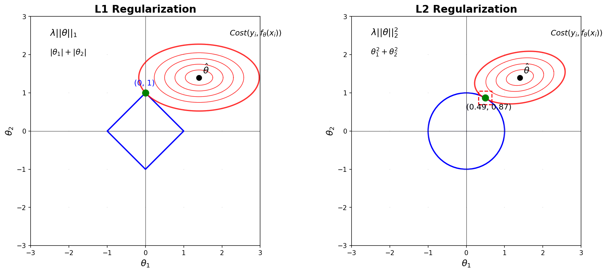

# L1 and L2 Regularization

## The Problem: Overfitting

Neural networks with too many parameters memorize training data instead of learning patterns. **Regularization** adds a penalty to prevent this:

$$\mathcal{L}_{\text{total}} = \mathcal{L}_{\text{data}} + \lambda \cdot \mathcal{R}(\theta)$$

## L1 vs L2: The Geometry Tells the Story



The key difference between L1 and L2 regularization lies in their geometry:

- **L1 norm**: $|\theta_1| + |\theta_2| = c$ creates a **diamond**
- **L2 norm**: $\theta_1^2 + \theta_2^2 = c$ creates a **circle**

### Why These Shapes?

**L1 Diamond:** The constraint $|\theta_1| + |\theta_2| = c$ creates four linear boundaries:
- Quadrant I: $\theta_1 + \theta_2 = c$ (slope = -1)
- Quadrant II: $-\theta_1 + \theta_2 = c$ (slope = +1)  
- Quadrant III: $-\theta_1 - \theta_2 = c$ (slope = -1)
- Quadrant IV: $\theta_1 - \theta_2 = c$ (slope = +1)

These connect at corners *exactly on the axes* at $(±c, 0)$ and $(0, ±c)$.

**L2 Circle:** The constraint $\theta_1^2 + \theta_2^2 = c$ is simply a circle with radius $\sqrt{c}$.

### The Crucial Insight: Corners = Sparsity

When we optimize:
1. Cost function contours expand from the unconstrained optimum
2. They first touch the constraint boundary
3. **L1**: Often hits at a corner → one parameter becomes exactly zero → **sparse solution**
4. **L2**: Hits smooth boundary → parameters shrink but stay non-zero → **dense solution**

## Mathematical Details

| Aspect | L1 (Lasso) | L2 (Ridge) |
|--------|------------|------------|
| Penalty | $\sum\|\theta_i\|$ | $\sum\theta_i^2$ |
| Gradient | $\text{sign}(\theta_i)$ | $2\theta_i$ |
| Effect | Forces weights to 0 | Shrinks weights uniformly |
| Use when | Many irrelevant features | All features matter |

The gradient difference is key:
- **L1**: Constant force regardless of weight size → can push to exactly zero
- **L2**: Force proportional to weight → diminishes near zero

## Implementation

```python
def regularization_loss(weights, reg_type='l2', lambda_reg=0.01):
    if reg_type == 'l1':
        return lambda_reg * sum(torch.abs(w).sum() for w in weights)
    elif reg_type == 'l2':
        return lambda_reg * sum((w**2).sum() for w in weights)
```

## When to Use Which?

**L1 Regularization:**
- Feature selection needed
- Interpretability important
- Sparse data

**L2 Regularization:**
- Multicollinearity present
- Need stable predictions
- All features relevant

**Elastic Net** combines both: $\alpha\sum|\theta_i| + (1-\alpha)\sum\theta_i^2$

## Choosing λ

- **Small λ**: Weak regularization → potential overfitting
- **Large λ**: Strong regularization → potential underfitting  
- **Find optimal λ**: Use cross-validation

The constraint size scales as $c = 1/\lambda$:
- L1: Diamond vertices at $(±1/\lambda, 0)$ and $(0, ±1/\lambda)$
- L2: Circle radius = $\sqrt{1/\lambda}$

## Summary

**L1 creates sparsity** because its diamond constraint has corners on the axes.  
**L2 creates density** because its circular constraint is smooth everywhere.

Choose based on your goal: feature selection (L1) or stable predictions (L2).